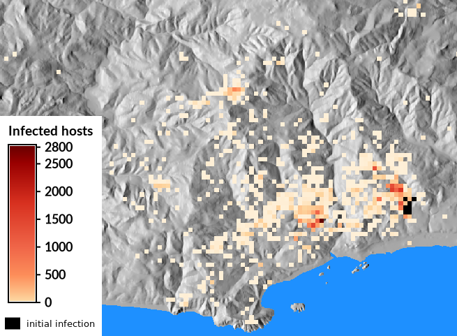

## DESCRIPTION

Module *r.pops.spread* is a dynamic species distribution model for pest
or pathogen spread in forest or agricultural ecosystems. The model is
process based meaning that it uses understanding of the effect of
weather on reproduction and survival of the pest or pathogen in order to
simulate spread of the pest or pathogen into the future using
simulation.

[](r_pops_spread.png)  
*Figure: Infected hosts in a landscape, a typical model result*

### About the model

The module is using the PoPS Core library which is implementing the PoPS
model and it is a central part of the [Pest or Pathogen Spread
(PoPS)](https://popsmodel.org/) project.

[](pops_logo.png)  
*Figure: Logo of the Pest or Pathogen Spread framework the PoPS is part
of*

The PoPS model is a stochastic spread model of pests and pathogens in
forest and agricultural landscapes. It is used for various pest,
pathogens, and hosts including animals, not just plants, as hosts. It
was originally developed for *Phytophthora ramorum* and the original
version of the model was written in R, later with Rcpp (Tonini, 2017),
and was based on Meentemeyer (2011) paper.

The current implementation of the GRASS GIS module is using PoPS Core
header-only C++ library which implements the PoPS model. The primary
development of [PoPS
Core](https://github.com/ncsu-landscape-dynamics/pops-core) and of [this
module](https://github.com/ncsu-landscape-dynamics/r.pops.spread)
happens in a separate repositories and GRASS GIS Addons repository
contains the latest release of the model. An alternative [steering
version](https://github.com/ncsu-landscape-dynamics/r.pops.spread/tree/steering)
of this module exists which includes a set of features supporting
geospatial simulation steering (Petrasova, 2020) which is useful for
exploring adaptive management scenarios.

### Model parameters

Two basic epidemiological model types (**model\_type**) are available
for a transition of hosts between susceptible and infected classes: 1)
susceptible-infected (SI) for an immediate transition when a disperser
establishes on the host and 2) susceptible-exposed-infected (SEI) for an
intermediate state when the host first becomes exposed and only after a
latency period (**latency\_period**) is over. This page lists above the
numerous inputs and parameters, although many of them have default
values, some need careful consideration and calibration. The best way
how to identify options relevant to a given use case is to go through
one of the available tutorials.

### Calibration

Typically, the model needs to be calibrated. You can obtain the
calibration from a published work, colleague, calibrate the model
manually (in GRASS GIS), or use the R interface to PoPS called
[rpops](https://github.com/ncsu-landscape-dynamics/rpops) which has
dedicated functions for calibration.

## NOTES

- The directions of wind consider north (N) to be grid north, if your
    true north is different direction, you need to make an adjustment.
- The module currently does not handle NULL (no data) as input, so you
    need to change the NULLs to (most likely) zeros, for example:
    `r.null map=infection null=0`.

## EXAMPLES

### Obtaining list of rasters

Use [R
script](https://github.com/ncsu-landscape-dynamics/weather-coefficient)
to create weather coefficients based on a defined polynomial.

Example of creating file with list of input maps (unix-like command
line):

```sh
g.list type=raster pattern="moisture_*" mapset=climate -m > moistures.txt
g.list type=raster pattern="temperature_*" mapset=climate -m > temperatures.txt
```

Note that the above assumes that the names will be ordered by time. This
will happen automatically if they are, e.g. numbered as 001, 002, etc.
(e.g. `temperature_001` and not `temperature_1`). If they are numbered
without the zero-padding, i.e. 1, 2, ..., 10, 11, ..., then in a
unix-like command line, you can do pipe the result through *sort* with
`-n` (`| sort -n`). For example, for map names like `temperature_1`, the
following unix-like command will do the sorting:

```sh
g.list type=raster pattern="temperature_*" mapset=climate | sort -k2 -t_ -n > temperatures.txt
```

Note the underscore which tells sort where to split the name for sorting
and the number 2 which indicates which part of the name to use for
sorting after splitting. If you have the weather-related timeseries in a
separate mapset, you can add this mapset to the search path of your
current mapset so that you can have the rasters in the list without
specifying the mapset. To add to the search path, use for example:

```sh
g.mapsets mapset=climate
```

### Generating a constant coefficient

In case the moisture coefficient is not used, we can generate a constant
raster map to be used as the coefficient:

```sh
r.mapcalc "const_1 = 1"
```

Then using unix-like command line, we can create a list of these rasters
in a file based on the number of lines in a temperature list files we
created earlier:

```sh
NUM_LINES=`cat temperatures.txt | wc -l`
echo const_1 > moistures.txt
for LINE in `seq 2 $NUM_LINES`; do echo const_1 >> moistures.txt; done;
```

### Creating treatments

To account for (vector) treatments partially covering host cells:

```sh
# set resolution for treatments and convert to raster
g.region res=10 -ap
v.to.rast input=treatment output=treatment use=val

# resample to lower resolution (match host map resolution)
g.region align=host_map -p
r.resamp.stats -w input=treatment output=treatment_resampled method=count
# get maximum value, which is dependent on resolution
# e.g. when resampling from 10m to 100m, max will be 100 (100 small cells in 1 big cell)
r.info -r treatment_resampled
# result will be 0 to 1
r.mapcalc "treatment_float = test_treatment_resampled / 100"
# adjust host layer
r.mapcalc "treated_host = host - host * treatment_float"
```

### Running the model

Example of the run of the model (unix-like command line):

```sh
r.pops.spread host=host total_plants=all infected=infected_2005 \
    moisture_coefficient_file=moistures.txt temperature_coefficient_file=temperatures.txt \
    output=spread step=week start_time=2005 end_time=2010 \
    reproductive_rate=4 dispersal_kernel=cauchy wind=NE random_seed=4
```

## REFERENCES

To cite this module, please refer to [How to
cite](https://github.com/ncsu-landscape-dynamics/r.pops.spread#how-to-cite)
section in the readme file.

- Meentemeyer, Ross K., Nik J. Cunniffe, Alex R. Cook, Joao A. N.
    Filipe, Richard D. Hunter, David M. Rizzo, and Christopher A.
    Gilligan, 2011. Epidemiological modeling of invasion in
    heterogeneous landscapes: spread of sudden oak death in California
    (1990-2030). *Ecosphere* 2:art17.
    [DOI: 10.1890/ES10-00192.1](https://doi.org/10.1890/ES10-00192.1)
- Tonini, Francesco, Douglas Shoemaker, Anna Petrasova, Brendan
    Harmon, Vaclav Petras, Richard C. Cobb, Helena Mitasova, and Ross K.
    Meentemeyer. Tangible geospatial modeling for collaborative
    solutions to invasive species management. *Environmental Modelling &
    Software* 92 (2017): 176-188.
    [DOI: 10.1016/j.envsoft.2017.02.020](https://doi.org/10.1016/j.envsoft.2017.02.020)
- Petrasova, A., Gaydos, D.A., Petras, V., Jones, C.M., Mitasova, H.
    and Meentemeyer, R.K., 2020. Geospatial simulation steering for
    adaptive management. *Environmental Modelling & Software* 133:
    104801.
    [DOI: 10.1016/j.envsoft.2020.104801](https://doi.org/10.1016/j.envsoft.2020.104801)

## SEE ALSO

*[r.spread](https://grass.osgeo.org/grass-stable/manuals/r.spread.html),
[r.grow](https://grass.osgeo.org/grass-stable/manuals/r.grow.html),
[r.lake](https://grass.osgeo.org/grass-stable/manuals/r.lake.html),
[r.futures](r.futures.md)*

Tutorials and other resources:

- [PoPS Model Introduction in GRASS Using Jupyter
    Notebook](https://github.com/ncsu-landscape-dynamics/pops-intro-grass-notebook/blob/master/pops-intro-grass-notebook.ipynb)
    [](https://mybinder.org/v2/gh/ncsu-landscape-dynamics/pops-intro-grass-notebook/master?urlpath=lab/tree/pops-intro-grass-notebook.ipynb "Go to an interactive notebook in Binder")
- [SOD Spread
    tutorial](https://grasswiki.osgeo.org/wiki/SOD_Spread_tutorial) (at
    GRASS wiki)

## AUTHORS

In alphabetical order:

Chris Jones\*  
Margaret Lawrimore\*  
Vaclav Petras\*  
Anna Petrasova\*  

Previous contributors:

Zexi Chen\*  
Devon Gaydos\*  
Francesco Tonini\*  
  
\* [Center for Geospatial Analytics, NC State
University](http://geospatial.ncsu.edu/)
